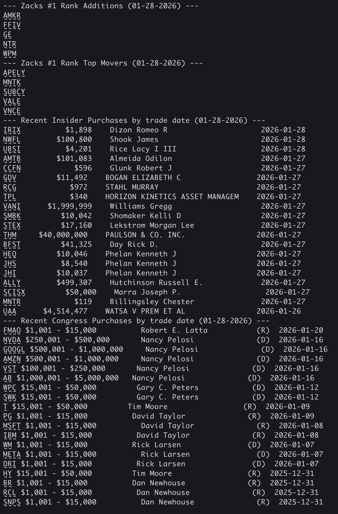

# stonks
Cross-platform web scraper/CLI tool for returning clickable stock tickers with recent purchases in your terminal.

You can also run this in a discord server i.e., `./stonksbot.py`

### Prerequisites
Install Python dependencies:
```bash
pip install -r requirements.txt
```

**Run on MacOS/Linux:**
```bash
./run.sh
```

**Run on Windows:**
```powershell
.\run.ps1
```

### Output
The clickable links in your terminal route to the corresponding ticker on Yahoo Finance.

**CLI Output**



**Discord Bot** 


Two csv's are also created 

```
congress_trading_data.csv
insider_trading_data.csv
```

### Contributing
The goal of this code is to speed up the retrieval of recent insider stock purchases, recent congressional stock
purchases,and recent institutional stock purchases via obtaining the data programmatically & outputting clickable links to tickers
in your terminal.

**NOTE: Please aim to keep the code simple, lightweight, and portable (aka easy for anyone to use on any machine)**
